1. Install vagrant and virtual box
2. Create and initiate the Vagrantfile
   - The static ip addresses given to the created VMs are not arbitrary, they're actually within the subnet of the virutalbox virtual network interface.
3. Use `vagrant up` command in the cli to bring up the VMs
    - It will take some time to download and setup the box images
    - To turn off the VMs gracefully use `vagrant halt`
    - To destroy the VMs use `vagrant destroy`
  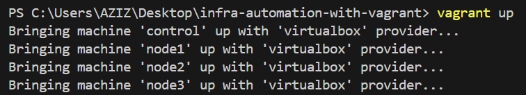
  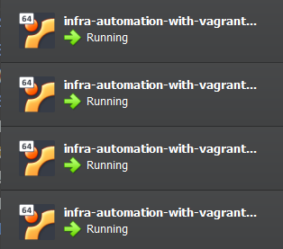
  The provisioned VMs are up and running
4. Use `vagrant ssh control` to establish a ssh connection to the control VM (the default password is *vagrant*)
5. Inside the VM, if use go in the `/vagrant` directory, you'll find the same files that are in your host machine (project directory). These files are shared between the host and all the provisioned VMs.
6. We need to ensure that the control node can ping all the other nodes. To do so we need to add node hostnames and IP addresses to the `/etc/hosts` file. First, add this hosts file to your project directory, then after logging in the control VM using ssh, execute this command: `sudo cp /vagrant/hosts /etc/hosts`.
    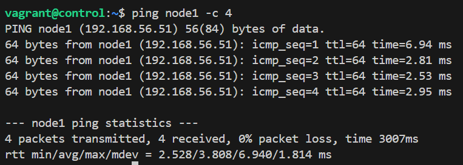
    The ping command is now working successfully
7. To make (node) hosts ssh accessible (from control hosts) we need to execute these two command:
   1. `ssh-keygen` to generate ssh key pairs
   2. `ssh-copy-id node1 && ssh-copy-id node2 && ssh-copy-id node3` to copy the local SSH public key to the respective remote server.
8. To login to one of the nodes (node1 for example), we just need to run `ssh vagrant@node1`
    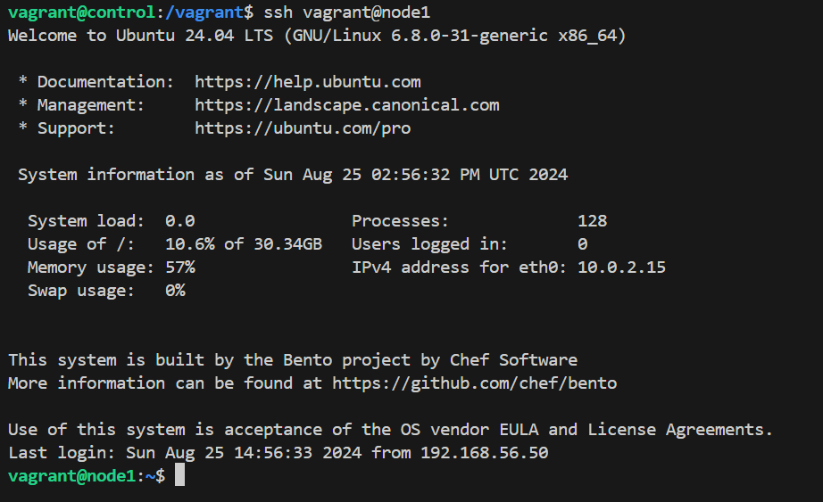
    We are inside node1 VM
9. In your host machines (project folder) create a directory called `ansible/`. Within that directory, create two files: `myhosts` (that will be our inventory file) and `playbook_docker.yml` (that will be our main playbook for this project).
10. Add host groups and hosts to `ansible/myhosts` file, and add define tasks in the `ansible/playbook_docker.yml` file.
11. To make sure basic ansible connectivity is working without running the playbook, we need to run an ad-hoc ansible command. In our case, we'll run this command `ansible nodes -i /vagrant/ansible/myhosts -m command -a hostname`
    - But first, we need to install ansible in our control VM.
    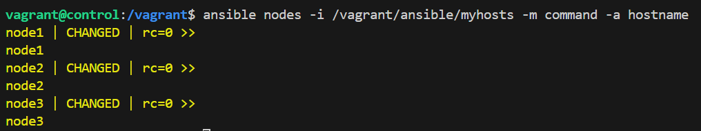
    The ad-hoc command was successful.
12.  Now we gonna run the playbook, using this command: `ansible-playbook -i /vagrant/ansible/myhosts -K /vagrant/ansible/playbook_docker.yml`.
    - We will be promted to type the **BECOME password**, which is the same as the sudo password to every node machine. Remember: the password is *vagrant*.
  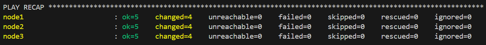
  Everything went as expected.
13. We can ssh to node1 and verify that docker was indeed installed sucessfully
    1.  from the control VM, run `ssh vagrant@node1`.
    2.  Yes docker was installed successfully.
        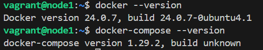
14. Create the `app.py` file.
15. Create the `requirements.txt` file.
16. Create `Dockerfile` and `docker-compose.yml` files.
17. Populate all the previously mentionned files (4 files)
18. Login to node1 (through ssh) and run the container in detach mode. To do so, you can run this command `docker compose -f /vagrant/docker-compose.yml up -d`.
    - When running the container for the very first time, it will automatically build the docker image first using the `Dockerfile`.
19. On you host pc, go to the browser and type `<node1_ip_address>:5000`. If everything is working as planned u should get this page:
    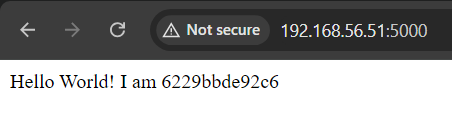
    And on our control VM, we run `curl node1:5000`
    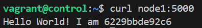
20. In your project directory, create a folder called `docker-swarm`
    1.  Create and populate a file called called `swarm.yml` that will be our playbook to setup swarm.
    2.  Create and populate a file called called `myhosts` that will be our inventory for that playbook.
21. To setup swarm, run this command `ansible-playbook -i /vagrant/docker-swarm/myhosts -K /vagrant/docker-swarm/swarm.yml` (Remember: BECOME password is *vagrant*).
22. To verify docker swarn was correctly setup on our nodes, we have to ssh login to one of the nodes (node1 for example) and run `sudo docker node ls`.
    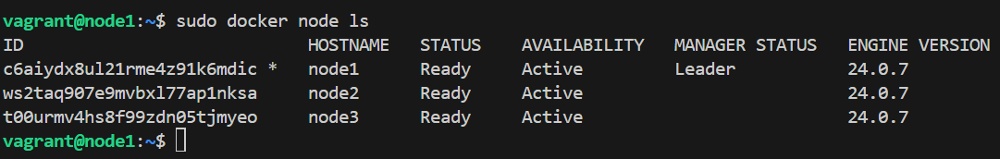
    Brilliant! Node1 is indeed the manager.
23. To run our application in the docker swarm, we need to:
    1.  Shut down the running container in node1 using `docker compose down` command. Make sure you are in the directory where the `docker-compose.yml` file is!
    2.  We need to build our flask web app docker image. use `docker build -t vagrant-project/flaskwebapp .`
    3.  Go to the `docker-swarm` directory and create and new `docker-compose.yml` that will have small changes from our initial /vagrant/docker-compose.yml file.
    4.  Run this command to start the web app on docker swarm: `docker stack deploy --compose-file docker-compose.yml myapp`. Make sure you are in the `docker-swarm` directory!
    5.  To remove the newly created stack `myapp` you can use `docker stack rm myapp`.
24. Remember, we're still in the node1 VM. After running the `docker stack services myapp` command, we can see that our app have just one single replica for now. What we gonna do is to scale up our application to 3 nodes. To do so, run this command: `docker service scale myapp_web=3`.
    - Even if we just have 3 node VMs, we are not limited to just 3 replicas. We can have as much replicas as we want (6 for examples). Our only constraint is the VM computing power (cpu, memory, ...).
    TADAAA!
    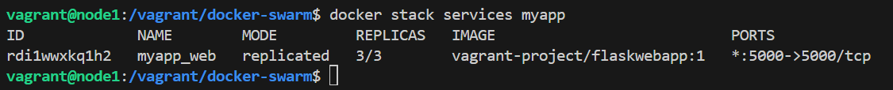
    We can also run `docker service ps myapp_web` to see more details. That command output can actually show us that the load balancing is really working.
    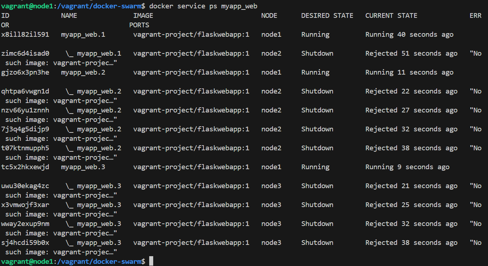
25. If we login to the control VM and run many `curl` command to the `node:5000`, we can see that each time the printed hostname is different. That is due to the load balancing.
    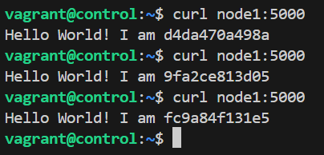
    Same thing with the other nodes:
    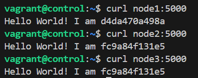
    If you want to control the load balancing between the nodes, you can use some tools like *nginx*.

