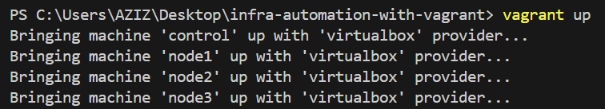
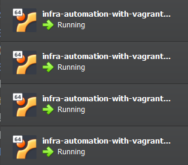
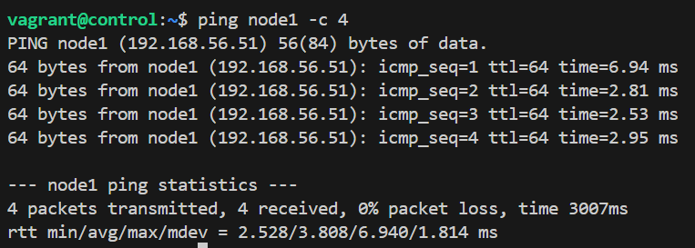
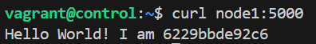
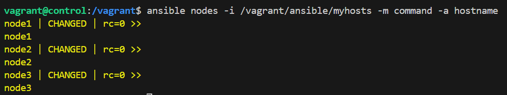
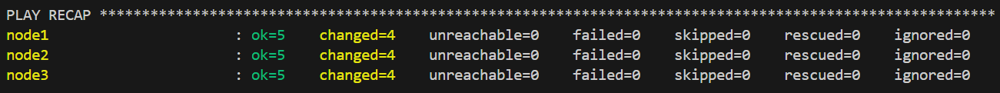
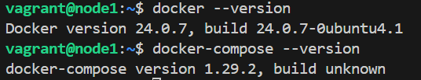

1. Install vagrant and virtual box
2. Create and initiate the Vagrantfile
   - The static ip addresses given to the created VMs are not arbitrary, they're actually within the subnet of the virutalbox virtual network interface.
3. Use `vagrant up` command in the cli to bring up the VMs
    - It will take some time to download and setup the box images
    - To turn off the VMs gracefully use `vagrant halt`
    - To destroy the VMs use `vagrant destroy`
  
  
  The provisioned VMs are up and running
4. Use `vagrant ssh control` to establish a ssh connection to the control VM (the default password is *vagrant*)
5. Inside the VM, if use go in the `/vagrant` directory, you'll find the same files that are in your host machine (project directory). These files are shared between the host and all the provisioned VMs.
6. We need to ensure that the control node can ping all the other nodes. To do so we need to add node hostnames and IP addresses to the `/etc/hosts` file. First, add this hosts file to your project directory, then after logging in the control VM using ssh, execute this command: `sudo cp /vagrant/hosts /etc/hosts`.
    
    The ping command is now working successfully
7. To make (node) hosts ssh accessible (from control hosts) we need to execute these two command:
   1. `ssh-keygen` to generate ssh key pairs
   2. `ssh-copy-id node1 && ssh-copy-id node2 && ssh-copy-id node3` to copy the local SSH public key to the respective remote server.
8. To login to one of the nodes (node1 for example), we just need to run `ssh vagrant@node1`
    
    We are inside node1 VM
9. In your host machines (project folder) create a directory called `ansible/`. Within that directory, create two files: `myhosts` (that will be our inventory file) and `playbook_docker.yml` (that will be our main playbook for this project).
10. Add host groups and hosts to `ansible/myhosts` file, and add define tasks in the `ansible/playbook_docker.yml` file.
11. To make sure basic ansible connectivity is working without running the playbook, we need to run an ad-hoc ansible command. In our case, we'll run this command `ansible nodes -i /vagrant/ansible/myhosts -m command -a hostname`
    - But first, we need to install ansible in our control VM.
    
    The ad-hoc command was successful.
12.  Now we gonna run the playbook, using this command: `ansible-playbook -i /vagrant/ansible/myhosts -K /vagrant/ansible/playbook_docker.yml`.
    - We will be promted to type the **BECOME password**, which is the same as the sudo password to every node machine. Remember: the password is *vagrant*.
  
  Everything went as expected.
13. We can ssh to node1 and verify that docker was indeed installed sucessfully
    1.  from the control VM, run `ssh vagrant@node1`.
    2.  Yes docker was installed successfully.
        
14. 